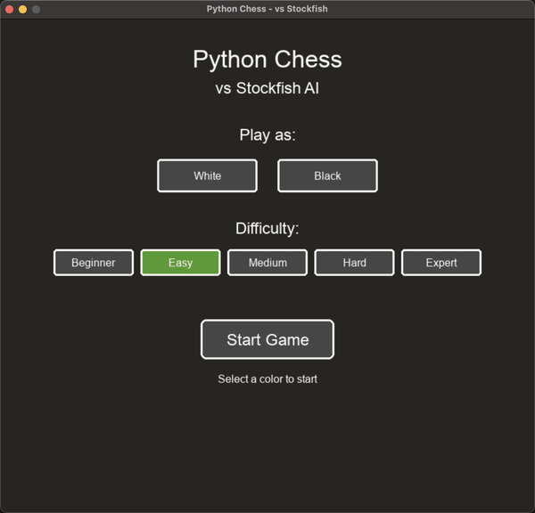

# Python Chess GUI



A Python chess application with a graphical user interface built using pygame and python-chess library, featuring player vs Stockfish AI gameplay.

## Features

- Player vs Stockfish AI gameplay
- Color selection (play as White or Black)
- Adjustable AI difficulty (Level 1-5)
- Move takeback (undo)
- Hint system (get Stockfish's suggested move)
- Real-time evaluation bar
- Visual highlights for legal moves, last move, and check

## Requirements

- Python 3.12+
- Stockfish engine

## Installation

### Option 1: Install from PyPI (recommended)

```bash
pipx install python-chess-gui
```

Or with pip in a virtual environment:
```bash
python -m venv venv
source venv/bin/activate  # On Linux/macOS
pip install python-chess-gui
```

### Option 2: Install from source

1. Clone the repository:
   ```bash
   git clone git@github.com:Bobain/python-chess-gui.git
   cd python-chess-gui
   ```

2. Install dependencies with uv:
   ```bash
   uv sync
   ```

### Install Stockfish

- macOS: `brew install stockfish`
- Linux (Debian/Ubuntu): `sudo apt install stockfish`
- Linux (Fedora): `sudo dnf install stockfish`
- Linux (Arch): `yay -S stockfish` (from AUR)

Alternatively, set the `STOCKFISH_PATH` environment variable to the full path of the Stockfish executable:
```bash
export STOCKFISH_PATH=/path/to/stockfish
```

## Usage

Run the application:
```bash
chess-gui
```

Or if installed from source with uv:
```bash
uv run chess-gui
```

### Controls

- **Mouse click**: Select piece / move piece / menu selection
- **H**: Get a hint (Stockfish's suggested move)
- **Z**: Undo last move
- **N**: New game (return to menu)
- **Q / Escape**: Quit

## Project Structure

```
python-chess-gui/
├── src/
│   └── python_chess_gui/
│       ├── __init__.py
│       ├── main.py
│       ├── constants.py
│       ├── coordinate_converter.py
│       ├── chess_board_renderer.py
│       ├── game_state_manager.py
│       ├── user_input_handler.py
│       ├── stockfish_engine_controller.py
│       ├── game_status_display.py
│       ├── evaluation_bar_renderer.py
│       └── game_settings_menu.py
├── pyproject.toml
├── README.md
└── .gitignore
```

## Development

This project uses:
- **uv** for dependency management
- **pygame** for the graphical interface
- **python-chess** for chess logic and Stockfish communication

## License

MIT License
